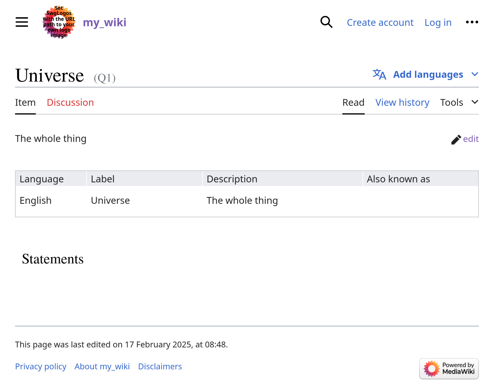
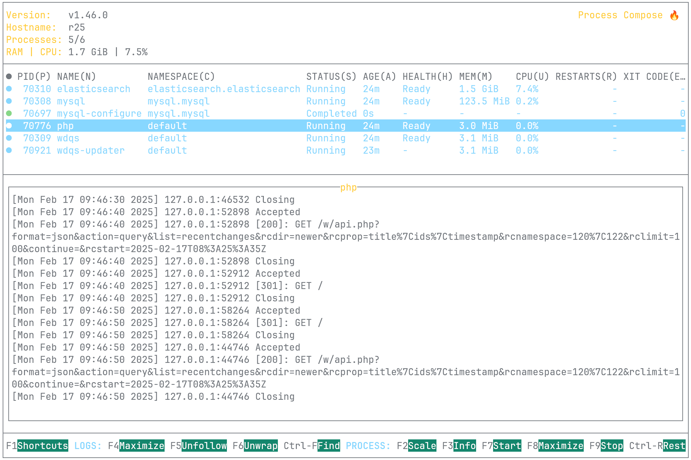

# Wikibase Nix Flake

## Overview
A Nix flake for running Wikibase, the software stack behind [Wikidata.org](https://wikidata.org) to host your own Knowledge Graph. It uses [service-flakes](https://github.com/juspay/services-flake) and [process-compose](https://github.com/F1bonacc1/process-compose) to run a [MediaWiki](https://www.mediawiki.org/wiki/MediaWiki) instance hosting the [Wikibase](https://wikiba.se/) extension, [MariaDB](https://mariadb.org/), and [WDQS (Wikidata Query Service)](https://www.wikidata.org/wiki/Wikidata:SPARQL_query_service).

**The current version is an early-stage proof-of-concept and is not yet production-ready.** For a production-ready Wikibase distribution, check out [Wikibase Suite](https://github.com/wmde/wikibase-release-pipeline).



## Run the stack
Install nix and
```sh
nix run github:rti/wikibase-flake
```



